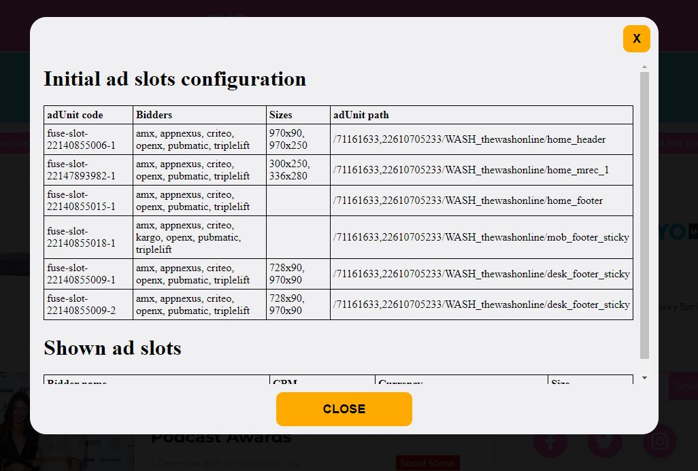
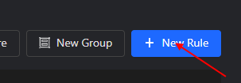
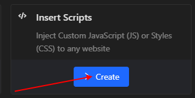
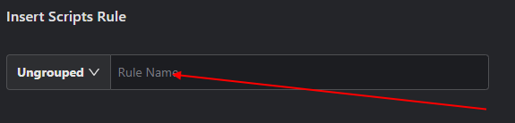
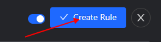

# Ad slots stats

The custom script that gets information about ad slots on the website using Prebid.js and Google Publisher Tag (GPT)
Also, it intercepts URL addresses of all the `fetch` requests from the page and sends them to the custom server
The custom server logs received URL addresses in the console

## Bulding script

- source script's files are in the `client/` directory
- the result script code is `build/client/bundle.js`
- run `npm run bundle` in the terminal to generate the `build/client/bundle.js`

## Injecting the script into the web page

- use [Requestly](https://app.requestly.io/rules/my-rules) to inject the script into the web page.
  To do that just follow this

  

    
tutorial

  Install and open Requestly extension
  
  STEP #1 Add new rule
    

  STEP #2 Choose Insert Scripts option
    

  STEP #3 Type the name of your rule
    

  STEP #4 Insert the code from the `build/client/bundle.js`
    

  STEP #5 Confirm creating the rule
    
  

- On opening every web page the script will automatically detect if there are Prebid.js and Google Publisher Tag (GPT)
  If it finds them it will display the `Show popup` button in the bottom right corner of the web page
  
- Press this button to open popup windiw with information about ad slots on the page
- This web sites [https://thewash.online/](https://thewash.online/), [https://www.stereogum.com/](https://www.stereogum.com/) have Prebid.js and Google Publisher Tag (GPT) libraries installed. Use them to test the script

## Starting server

- source server's files are in the `server/` directory
- the result server code is in the `build/server/` directory
- to build and start the server use `npm start` command
- to start the server in development mode use `npm run dev` command
